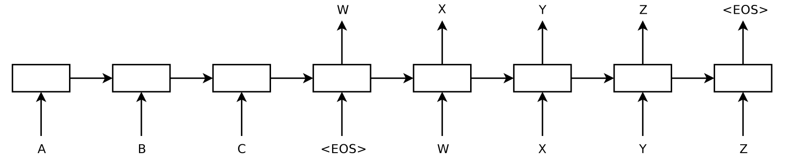

# Automatic Evaluation of Generative Dialogue Systems



## Introduction

This repository contains the LaTeX and Python sources of my bachelor's graduation project done at Beihang University in 2019. This work is mainly concerned with the automatic evaluation of the generative dialogue systems based on the Seq2Seq framework with a special focus on content diversity. This work was initially carried out as a graduation project and later it was extended with more in-depth analyses to form a submission to ICONIP-2019. Thanks to this process, it now contains both a Chinese version and an English version as follows:

- [Chinese version](docs/paper-zh.pdf) is the original version written as a bachelor's graduation project, namely, *A Diversity-oriented Analysis on Evaluating the Generative Dialogue Models*.
- [English version](docs/paper-en.pdf) is an extension of the Chinese version submitted to ICONIP-2019, namely, *Automatic Evaluation of Generative Dialogue Systems: An Empirical Study*.

The code locations are listed as follows:

- [paper-zh](paper-zh/README.md) contains the LaTeX source of the Chinese version.
- [paper-en](paper-zh/README.md) contains the LaTeX source of the Chinese version.
- [src](src/README.md) contains the Python source of the benchmark framework called `Eval`.
- [paper-zh/literature](paper-zh/literature/README.md) contains the pdf's and links to some of the classical literature of the generative dialogue systems.


## Briefing

This work is primarily an empirical study of the behaviors of dialogue metrics. Specifically, we categorized metrics into three groups, namely, n-gram-based, embedding-based, and model-based. Three representative Seq2Seq-based generative dialogue models were selected, namely, the LSTM language model, HRED, and VHRED. Three popular datasets were selected, namely, OpenSubtitles, Ubuntu, and LSDSCC. A grid of experiments composed of these metrics, models, and datasets was then carried out and results were collected and analyzed.

We first looked at the system-level scores (which measured how well a model behaved on a dataset) in a big table and found that no system could beat all the other ones along the datasets axis or metrics axis. This is likely due to the *No Free Lunch Theorem, NFL*.

We then looked at the utterance-level scores (which measured how good a generated response is) and plotted various diagrams for each (dataset, metric, model) triple. We found that the distributions of utterance-level scores were quite different along the metric axis but quite similar along either the model or dataset axis, showing signs of strong biases imposed by metrics. 


## Limitations

- This work basically reproduced known facts about dialogue metrics and systems. No new metrics, models, nor datasets were proposed.
- This work has been outdated since it was written in the age of the Seq2Seq framework. Now that the Transformer-based models have advanced the field of dialogue systems significantly, it is time for this work to retire.

## Related Links

Some related links that might be useful are listed as follows:

- [HRED and VHRED](https://github.com/julianser/hed-dlg-truncated.git) are the HRED and VHRED dialogue models proposed by Serban, et al.
- [Neural-Dialogue-Generation](https://github.com/jiweil/Neural-Dialogue-Generation.git) is a bunch of neural dialogue generators proposed by Jiwei Li, et al.
- [neural-dialogue-metrics](https://github.com/neural-dialogue-metrics) contain our implementations of several classical dialogue evaluation metrics, i.e., BLEU, ROUGE, METEOR, Distinct-N, EmbeddingBased, etc. 

## Acknowledgement

- This work was supervised by Prof. Wenge Rong, School of Computer Science and Engineering, Beihang University. Sincerely thanks to my supervisor.
- This work was inspired by *Liu, C.W., R., Serban, How NOT to evaluate your dialogue system: An empirical study of unsupervised evaluation metrics for dialogue response generation. EMNLP-2016*. Many thanks for your insights and efforts in making dialogue systems better.


## Citation

If you find our [metrics implementations](https://github.com/neural-dialogue-metrics) useful in your research, please consider citing us as follows:
```bibtex
@misc{cong_neural-dialogue-metrics_2019,
    title = {Neural-dialogue-metrics: {A} bunch of {Python} implementations of classical dialogue metrics},
    shorttitle = {Neural-dialogue-metrics},
    url = {https://github.com/neural-dialogue-metrics},
    abstract = {Neural-dialogue-metrics is a repository of Python implementations of several classical dialogue evaluation metrics, i.e., BLEU, ROUGE, METEOR, Distinct-N, EmbeddingBased, etc. It is written with correctness, efficiency, and readability in mind.},
    author = {Cong, Feng},
    year = {2019},
}
```